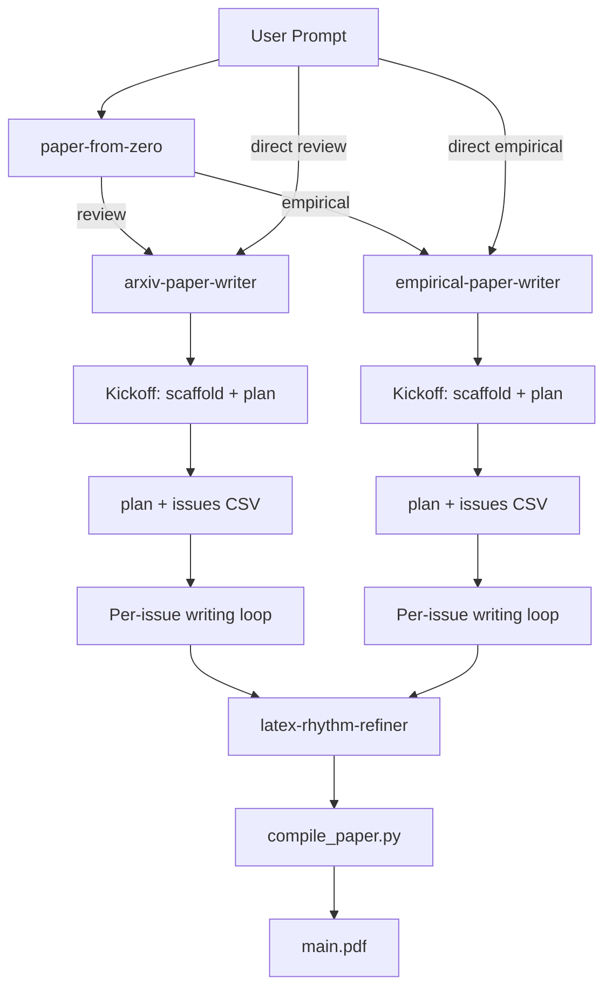

# 项目架构分析：`latex-paper-skills`

> 目标：把本仓库作为一个“可移植的 Skill Bundle”来理解——它为 Codex CLI / Claude Code 提供一套**端到端、以 issues 为执行合同**的 arXiv（IEEEtran 双栏）综述论文写作工作流，并附带可复用的脚本、模板与示例产物。

---

## 1. 总体架构设计

### 1.1 架构定位（是什么）

- **交付形态**：一个以 `.codex/skills/<skill-name>/SKILL.md` 为中心的技能包集合（Skill Bundle）。
- **运行方式**：由智能体在对话中触发某个 Skill，按 `SKILL.md` 的工作流逐步执行；需要确定性行为时调用 `scripts/` 下的脚本。
- **核心方法论**：把“写论文”拆成可验证的工序，并用 `plan/*.md` + `issues/*.csv` 做显式的门禁（gate）与进度合同（contract）。

### 1.2 顶层目录（模块边界）

```text
latex-paper-skills/
├─ .codex/
│  └─ skills/
│     ├─ paper-from-zero/
│     ├─ arxiv-paper-writer/
│     ├─ empirical-paper-writer/
│     ├─ latex-rhythm-refiner/
│     ├─ collaborating-with-claude/
│     └─ collaborating-with-gemini/
├─ projects/
│  ├─ rt-inflow-forecast-closed-loop/   # 实证论文 showcase
│  └─ peft-survey-2022-2026/            # 综述论文 showcase
├─ AGENTS.md                        # 仓库级工作流约束（门禁、引用验证等）
├─ ARCHITECTURE.md                  # 本文件
├─ agent-skills-standard.md         # Skill 包结构/写法的规范文档
├─ README.md / README.zh-CN.md
└─ .claude                          # Claude Code 兼容入口（内容为 ".codex"）
```

### 1.3 关键概念与“数据流”

本仓库的“架构”主要体现在**产物文件**的生命周期（而非传统服务/微服务）：

1. **Kickoff（框架期）**：生成 LaTeX 工程骨架 + `plan/<timestamp>-<slug>.md`（仅标题/要点/种子引用，禁止正文 prose）。
2. **Gate（审批期）**：用户在 plan 中勾选确认项（如 `User confirmed scope + outline...`）。
3. **Issues（执行合同）**：生成 `issues/<timestamp>-<slug>.csv`（每行一个可交付任务，含 `Status` 与 `Verified_Citations`）。
4. **Writing loop（按 issue 迭代）**：逐 issue 写作、查证引用、更新 CSV 进度。
5. **Refinement（润色）**：用 `latex-rhythm-refiner` 做节奏/冗词清理（不移动/增删引用）。
6. **QA + Compile（交付）**：编译、消除明显版式问题、输出 PDF。

可用下图理解主流程（概念图）：



### 1.4 设计取舍（为什么这么分）

- **Progressive disclosure**：`SKILL.md` 保持“可执行说明”，把可选的深度材料放 `references/`，把确定性动作放 `scripts/`，把可复用模板放 `assets/`。
- **低依赖、可移植**：主要脚本均为 Python 标准库实现（便于在不同机器/CI/沙盒里运行）。
- **可审计**：`arxiv_registry.py` 使用 SQLite 记录搜索与抓取（含 fetch 日志与哈希），避免“不可复现的随手搜索”。

---

## 2. 每个子模块设计功能

### 2.1 `paper-from-zero`（路由层）

- **职责**：从研究主题出发，进行文献搜索与创新框架分析，生成 5 个交接产物（topic brief、contribution map、evidence matrix、outline contract、router decision），然后路由到下游写作 Skill。
- **输入**：用户主题/研究方向。
- **输出**：`brief/topic-brief.md`、`brief/contribution-map.yaml`、`brief/evidence-matrix.csv`、`plan/outline-contract.md`、`plan/router-decision.md`。
- **路由规则**：review → `arxiv-paper-writer`；empirical → `empirical-paper-writer`。
- **特点**：纯智能体 Skill（无 Python 脚本），通过模板文件（`assets/`）强制格式一致性。

### 2.2 `arxiv-paper-writer`（综述论文模块）

- **职责**：端到端综述论文工作流（IEEEtran 双栏 LaTeX 工程）——从脚手架、计划、issues 合同、引用验证，到编译与质量门禁。
- **关键输出**：`main.tex`、`ref.bib`、`IEEEtran.cls`、`plan/`、`issues/`、（可选）`notes/`、`main.pdf`。
- **关键脚本入口**：`.codex/skills/arxiv-paper-writer/scripts/*.py`。
- **Issues CSV schema**：12 列（ID, Phase, Title, Section_Path, Description, Source_Policy, Target_Citations, Visualization, Acceptance, Status, Verified_Citations, Notes）。

### 2.3 `empirical-paper-writer`（实验论文模块）

- **职责**：端到端实验/方法论文工作流——在综述模块的基础上增加实验矩阵、结果状态追踪（planned/placeholder/verified）和证据-声明映射。
- **关键输出**：与 `arxiv-paper-writer` 相同的 LaTeX 产物，另含实验相关的占位符和结果追踪。
- **共享脚本**：复用 `arxiv-paper-writer/scripts/` 下的核心引擎（`arxiv_registry.py`、`compile_paper.py`、`citation_policy.py`、`source_ranker.py`、`style_profile.py`、`issue_workflow.py`）。
- **独有脚本**：`scripts/bootstrap_ieee_empirical_paper.py`、`scripts/create_empirical_plan.py`、`scripts/validate_empirical_paper_issues.py`。
- **Issues CSV schema**：18 列，新增 Claim_ID、Evidence_Type、Experiment_ID、Result_Status、Depends_On、Must_Verify。
- **5 个阶段**：Research (R)、Experiment (E)、Writing (W)、Refinement (RF)、QA (Q)。

### 2.4 `latex-rhythm-refiner`（润色模块）

- **职责**：对已完成的 LaTeX 正文做”节奏优化”（长短句/段落变化、去填充词），同时**严格保持所有 `\cite{...}` 的位置与语义绑定**。
- **特点**：纯规范/流程（无脚本），用来做写作阶段后的收尾质量提升。

### 2.5 `collaborating-with-claude`（外部协作：Claude Code）

- **职责**：通过桥接脚本把 Claude Code CLI 的输出统一封装成结构化 JSON，支持 `SESSION_ID` 多轮协作；适合做“第二意见/代码 review/提出 diff”。
- **关键产物**：`.codex/skills/collaborating-with-claude/scripts/claude_bridge.py`。

### 2.6 `collaborating-with-gemini`（外部协作：Gemini CLI）

- **职责**：同上，面向 Gemini CLI，输出结构化 JSON + `SESSION_ID` 续聊；提供 `--sandbox` 等参数透传。
- **关键产物**：`.codex/skills/collaborating-with-gemini/scripts/gemini_bridge.py`。

### 2.7 `projects/`（公开 showcase 工程）

- **职责**：保留少量精选项目，展示该工作流生成的真实论文工程结构（含 plan/issues/pdf，以及实证项目的结果文件）。
- **典型结构**：`main.tex`、`ref.bib`、`IEEEtran.cls`、`plan/*.md`、`issues/*.csv`；实证项目额外包含 `experiments/`、`paper/results/`、`paper/figures/`。

### 2.8 仓库级规范与兼容层

- `AGENTS.md`：写作流程的”硬约束”（无正文门禁、issues 合同、引用需验证等）。
- `agent-skills-standard.md`：如何组织一个可移植 Skill 的标准（`SKILL.md` + `assets/` + `scripts/` + `references/`）。
- `.claude`：Claude Code 侧的兼容入口（本仓库中为一个内容为 `.codex` 的轻量指针）。
- `.codex/settings.local.json`：本地运行权限/工具白名单配置；属于机器本地文件，不应进入公开快照。

### 2.9 共享核心与脚本依赖

`arxiv-paper-writer/scripts/` 是两个写作模块的共享脚本核心。`empirical-paper-writer` 通过相对路径 `../arxiv-paper-writer/scripts/` 调用这些脚本。

**脚本依赖关系**：

| 脚本 | 被谁使用 | 职责 |
|------|---------|------|
| `arxiv_registry.py` | review + empirical | arXiv 元数据/BibTeX 缓存（SQLite） |
| `compile_paper.py` | review + empirical | LaTeX 编译（latexmk / pdflatex + bibtex） |
| `citation_policy.py` | review + empirical | 引用审计（bib/tex 一致性、lint） |
| `source_ranker.py` | review + empirical | 来源质量评分 |
| `style_profile.py` | review + empirical | 目标期刊风格检查 |
| `issue_workflow.py` | review + empirical | Issues 执行（audit/sync/render-skeleton/append-bibtex） |
| `paper_utils.py` | review + empirical | 共享工具函数 |
| `source_policy_utils.py` | review + empirical | Source policy 工具函数 |
| `bootstrap_ieee_review_paper.py` | review only | 综述论文脚手架 |
| `create_paper_plan.py` | review only | 综述论文计划生成 |
| `validate_paper_issues.py` | review only | 综述 12 列 CSV 校验 |
| `bootstrap_ieee_empirical_paper.py` | empirical only | 实验论文脚手架 |
| `create_empirical_plan.py` | empirical only | 实验论文计划生成 |
| `validate_empirical_paper_issues.py` | empirical only | 实验 18 列 CSV 校验 |

**交接合同数据流**：

```
paper-from-zero (5 artifacts) ──→ arxiv-paper-writer (review path)
                               └─→ empirical-paper-writer (empirical path)
                                       └─→ latex-rhythm-refiner ──→ PDF
```

---

## 3. 子模块内部设计

### 3.1 `arxiv-paper-writer` 内部结构

```text
.codex/skills/arxiv-paper-writer/
├─ SKILL.md
├─ assets/
│  ├─ template/
│  │  ├─ IEEEtran.cls
│  │  ├─ main.template.tex
│  │  └─ references.template.bib
│  ├─ paper-plan-template.md
│  ├─ paper-issues-template.csv
│  └─ literature-notes-template.md
├─ references/                      # 深度说明：检索/写作/引用/可视化/QA
└─ scripts/
   ├─ bootstrap_ieee_review_paper.py
   ├─ create_paper_plan.py
   ├─ validate_paper_issues.py
   ├─ compile_paper.py
   ├─ arxiv_registry.py
   ├─ paper_utils.py
   ├─ issue_workflow.py
   ├─ citation_policy.py
   ├─ source_ranker.py
   ├─ source_policy_utils.py
   └─ style_profile.py
```

#### 3.1.1 脚本职责划分（脚本=确定性动作）

- `bootstrap_ieee_review_paper.py`
  - **定位**：一键入口；`--stage kickoff` 负责“拷贝模板→生成 plan”，`--stage issues` 负责“在 gate 通过后生成 issues CSV”。
  - **实现要点**：通过 `shutil.copytree()` 复制 `assets/template/`；把 `main.template.tex`/`references.template.bib` 重命名为 `main.tex`/`ref.bib`；再调用 `create_paper_plan.py`。

- `create_paper_plan.py`
  - **定位**：生成 `plan/*.md` 或 `issues/*.csv`（严格的门禁：issues 阶段要求 plan 存在且 gate 勾选通过）。
  - **实现要点**：
    - 从 `assets/` 读取模板，替换占位符（topic/timestamp/slug/latex_available）。
    - plan 文件写入 YAML frontmatter（`mode/topic/timestamp/slug/...`）。
    - `--stage issues` 时会扫描 plan 文件，检查行 `- [x] User confirmed scope + outline...` 是否被勾选。

- `validate_paper_issues.py`
  - **定位**：对 issues CSV 做 schema 校验（列头必须完全一致；状态/阶段枚举；ID 唯一；可选 strict 数值校验）。
  - **输出**：命令行摘要（按 Phase/Status 统计、引用进度等）。

- `compile_paper.py`
  - **定位**：编译 `main.tex`，优先 `latexmk`，否则 `pdflatex + bibtex` 多轮。
  - **实现要点**：可选 `--report-page-counts`，通过解析 `main.log` 与 `main.aux` 估算正文/参考文献页数（依赖 bibliography-start label）。

- `paper_utils.py`
  - **定位**：共享工具函数（`slugify/validate_*`、时间戳、路径定位、LaTeX 工具检测、`\cite{}` 与 BibTeX 统计等）。
  - **角色**：把“字符串/路径/格式约束”集中管理，减少各脚本重复实现。

#### 3.1.2 `arxiv_registry.py`（SQLite 注册表）内部设计

**定位**：以 arXiv 为主数据源的“可复现检索 + 元数据归一化 + BibTeX 缓存/导出”工具。

- **数据源**：arXiv Atom API（`https://export.arxiv.org/api/query`）+ arXiv BibTeX 页面（`https://arxiv.org/bibtex/<id>`）。
- **存储位置**：默认 `<project-dir>/notes/arxiv-registry.sqlite3`（可用 `--db` 覆盖）。
- **核心命令**：
  - `init`：初始化 schema
  - `search`：执行检索并持久化结果（含缓存 TTL）
  - `fetch-bibtex`：抓取/缓存 BibTeX（可选追加写入某个 `.bib` 文件）
  - `get`：按 arXiv id 输出 JSON lines（可选 `--fetch-missing`）
  - `export-bibtex`：以“稳定 citation key”重写 BibTeX entry key 后导出（支持按 `--search-id` 批量导出）

**核心表（按职责）**：

| 表 | 作用 |
|---|---|
| `schema_meta` | schema 版本与元信息 |
| `works` | 以 base arXiv id（去 vN）为键的论文元数据（title/summary/doi/pdf_url 等） |
| `authors` / `work_authors` | 作者去重 + 顺序关联（position 保序） |
| `searches` / `search_results` | 检索请求与结果快照（含 raw_xml 与哈希，便于审计/复现） |
| `bibtex` | 每个 work 最新一次抓取的 BibTeX（含 sha256） |
| `fetches` | 远端抓取日志（kind/url/status/hash/bytes） |
| `citation_keys` | 为每个 work 生成并固化 citation key（避免导出时漂移） |

**citation key 生成策略（概念）**：

1. 取第一作者姓 + 年份 + 标题首词，规范化拼接为 `base_key`；
2. 若冲突，则追加 arXiv id 数字后缀或 `work_id`；
3. 写入 `citation_keys` 表，后续导出时复用同一 key；
4. 导出阶段用 `rewrite_bibtex_key()` 把 `@...{oldKey,` 替换为稳定 key。

### 3.2 `empirical-paper-writer` 内部结构

```text
.codex/skills/empirical-paper-writer/
├─ SKILL.md
├─ assets/
│  ├─ template/
│  │  ├─ main.template.tex
│  │  └─ references.template.bib
│  ├─ paper-plan-template.md
│  ├─ paper-issues-template.csv
│  └─ literature-notes-template.md
├─ references/
│  ├─ research-workflow.md
│  ├─ experiment-evidence.md
│  ├─ results-writing.md
│  └─ reviewer-loop.md
└─ scripts/
   ├─ bootstrap_ieee_empirical_paper.py
   ├─ create_empirical_plan.py
   └─ validate_empirical_paper_issues.py
```

- **共享脚本调用方式**：通过 `python3 ../arxiv-paper-writer/scripts/<script>.py` 调用共享引擎。
- **18 列 Issues CSV**：在 review 的 12 列基础上增加 `Claim_ID`、`Evidence_Type`、`Experiment_ID`、`Result_Status`、`Depends_On`、`Must_Verify`，用于实验追踪和证据-声明映射。
- **`issue_workflow.py` 兼容**：通过 column-presence 检查（而非 schema 名称）同时支持 12 列和 18 列 CSV。

### 3.3 `paper-from-zero` 内部结构

```text
.codex/skills/paper-from-zero/
├─ SKILL.md
├─ assets/
│  ├─ topic-brief-template.md
│  ├─ contribution-map-template.yaml
│  ├─ evidence-matrix-template.csv
│  ├─ outline-contract-template.md
│  └─ router-decision-template.md
└─ references/
   ├─ architecture.md
   ├─ innovation-framing.md
   ├─ routing-policy.md
   └─ handoff-contract.md
```

- **纯智能体 Skill**：无 Python 脚本。所有 5 个交接产物由智能体基于模板生成，下游写作 Skill 直接读取。
- **路由决策**：根据主要贡献类型（综述 vs 实验）选择下游 Skill。

### 3.4 `collaborating-with-claude` 内部结构

```text
.codex/skills/collaborating-with-claude/
├─ SKILL.md
├─ assets/prompt-template.md
├─ references/shell-quoting.md
└─ scripts/claude_bridge.py
```

`claude_bridge.py` 的内部划分：

- **命令构造层**：把桥接脚本的 argparse 参数，透传/翻译为 `claude --print ... --output-format ...` 等 CLI 参数。
- **执行层**：`subprocess.Popen()` 运行 Claude Code；捕获 stdout/stderr（文本行）。
- **解析层**：
  - `parse_stream_json()`：逐行 `json.loads()`，跟踪 `role=assistant` 的 delta/消息，拼接 `agent_messages`；
  - 从输出中提取 `session_id`，并统一输出 `{success, SESSION_ID, agent_messages, error?, all_messages?}`。

### 3.5 `collaborating-with-gemini` 内部结构

```text
.codex/skills/collaborating-with-gemini/
├─ SKILL.md
├─ assets/prompt-template.md
├─ references/shell-quoting.md
└─ scripts/gemini_bridge.py
```

`gemini_bridge.py` 的内部划分：

- **执行层**：以 `gemini -o stream-json <prompt>` 方式运行；使用线程分别读 stdout/stderr。
- **完成判定**：检测到 `type == "turn.completed"` 后延迟终止子进程（避免 CLI 长尾阻塞）。
- **解析/输出**：逐行 JSON 解析，累计 assistant 文本，提取 `session_id`，并输出统一 JSON 结构。

### 3.6 `latex-rhythm-refiner` 内部结构

该模块没有脚本，内部设计就是“约束 + 流程”：

- **硬约束**：不增删、不移动任何 `\cite{...}`；不改 LaTeX 结构/命令；不改技术含义。
- **流程**：按 section 粒度处理 → 标注引用点 → 调整句段长短与冗词 → 自检清单（引用数量不变、语义绑定不漂移等）。

### 3.7 `projects/`（公开 showcase）内部结构（用于对齐预期）

以 `projects/peft-survey-2022-2026/` 为例：

```text
projects/<paper>/
├─ main.tex
├─ ref.bib
├─ IEEEtran.cls
├─ main.pdf
├─ plan/<timestamp>-<slug>.md
└─ issues/<timestamp>-<slug>.csv
```

实证 showcase 还会包含：

```text
experiments/
├─ configs/default.yaml
├─ run_all.py
└─ ...

paper/results/
├─ main_results.csv
├─ ablation_results.csv
└─ ...
```
